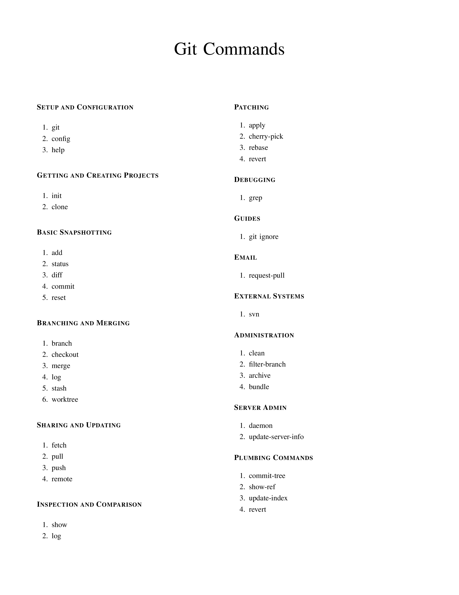

<h1>Git Cheatsheet</h1>
A cheatsheet to ease off the usage of git, a distributed version control system.

<h2> Table of Contents </h2>

- [Introduction](#introduction)
- [Motivation](#motivation)
- [Tools](#tools)
- [Project status](#project-status)
- [Preview](#preview)
- [Installation](#installation)
    - [Get repository](#get-repository)
- [License](#license)

## Introduction
Git is a distributed version control system used for code management. This repository is a git cheat sheet with some regularly used git commands.

## Motivation
I created this cheatsheet for my references as it is hard to checkout on the git website or other resources. 

## Tools
- Latex
- Shell
- git

## Preview


[Download Git Cheatsheet](Git-Cheatsheet.pdf)

## Project Status
**In progress**

## Installation
### Get repository
```git
git https://github.com/msaf9/git-cheatsheet.git
cd git-cheatsheet
```

## License
[LICENSE](LICENSE)